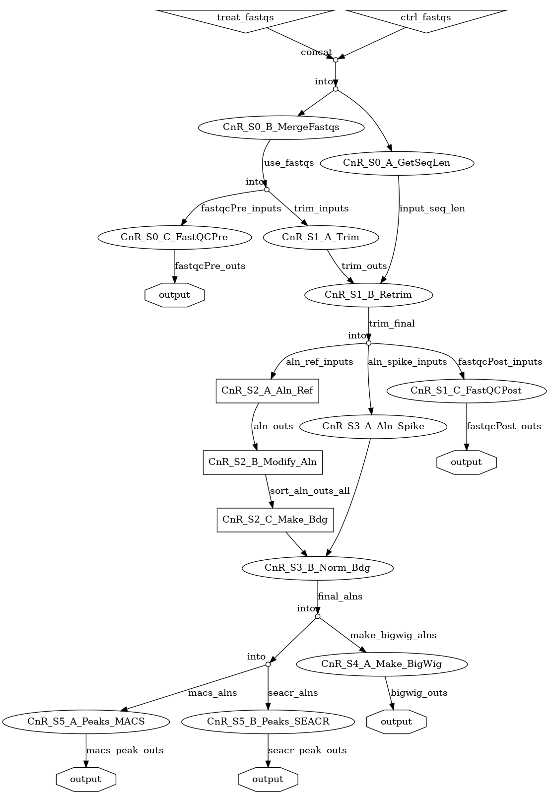

.. include:: index_contents.rst

.. |References| replace:: :ref:`References`
.. |Dependencies| replace:: :ref:`Dependencies`
.. |Dependency Config| replace:: :ref:`Dependency Config`
.. |Task Setup| replace:: :ref:`Task Setup`

.. |docs_link| replace:: this documentation

.. toctree::
   :maxdepth: 2
   :caption: Documentation Contents:

   CUT&RUN-Flow <self>
   source/workflow
   source/task_setup
   source/pipe_setup
   source/example_files
   source/references
   source/about

